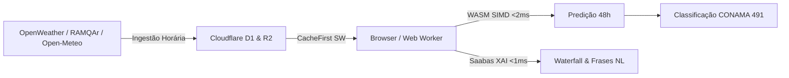

# AetherML — 01 Visão Geral e Arquitetura do Sistema

O **AetherML** é uma plataforma inteligente e descentralizada para previsão horária da qualidade do ar (concentração de partículas $PM_{2.5}$, $PM_{10}$, e gases fotoquímicos $SO_2$, $NO_2$, $O_3$) e classificação regulatória do Índice de Qualidade do Ar (IQAr, conforme Resolução CONAMA 491/2018 e diretrizes do IEMA/ES) na Região Metropolitana da Grande Vitória (RMGV), abrangendo os municípios de Vitória, Vila Velha, Serra e Cariacica.

---

## 1. Paradigma: Inferência no Cliente (Client-Side Edge)

Diferente de sistemas convencionais que dependem de clusters pesados de servidores em nuvem para processar inferências a cada requisição de usuário, o AetherML adota o paradigma **Client-Side WASM SIMD**:

- **Modelos**: 5 regressores LightGBM serializados no formato ONNX (`ai.onnx.ml:TreeEnsembleRegressor`), otimizados para menos de **1,5 MB** cada.
- **Runtime**: ONNX Runtime Web (`ort.wasm`) executado dentro de um **Web Worker** dedicado na thread secundária do navegador.
- **Aceleração**: WebAssembly com extensões vetoriais **SIMD-128** e multithreading via `SharedArrayBuffer` (habilitados através dos headers HTTP `COOP: same-origin` e `COEP: require-corp`).
- **Latência Comprovada**: Cálculo das 48 horas de horizonte preditivo em **menos de 2 milissegundos**.
- **Privacidade e Custo**: Zero envio de dados de geolocalização do usuário para servidores externos; custo de computação serverless reduzido a zero para a inferência.

---

## 2. Por que WebAssembly SIMD vs. WebGPU para Árvores de Decisão?

Embora WebGPU seja excelente para redes neurais densas e transformadores matriciais, para ensembles de árvores de decisão (LightGBM/XGBoost) o WebGPU é significativamente inferior ao WASM SIMD:

1. **Divergência de Threads em Arquiteturas SIMT**: Em GPUs, threads no mesmo warp executando ramificações condicionais distintas (`if/else` por limiar de nó) sofrem serialização forçada.
2. **Acesso Esparso à Memória**: A navegação por nós de árvores demanda saltos aleatórios de memória, gerando alto índice de cache-miss na VRAM.
3. **Overhead de Compilação de Shaders WGSL**: Criar buffers de dispositivo e compilar pipelines WGSL consome dezenas de milissegundos — muito mais do que a inferência inteira em CPU.

Portanto, o backend primário e mandatório é **WASM SIMD-128**, reservando WebGPU estritamente para futuras redes neurais convolucionais (CNN) de sensoriamento orbital de aerossóis.

---

## 3. Matriz Tecnológica do Monorepo

| Componente | Tecnologia | Função Principal |
| :--- | :--- | :--- |
| **Frontend Web** | Astro + Svelte 5 + UnoCSS | Shell estático ultrarrápido, reatividade fina com Runes (`$state`, `$derived`). |
| **Worker WASM** | `onnxruntime-web` (`ort.wasm`) | Execução de 5 modelos ONNX + Saabas XAI em Web Worker dedicado. |
| **Cálculo Regulatório** | `@aetherml/core-iqar` | Cálculo estritamente puro das faixas CONAMA 491/2018 (zero I/O). |
| **Geolocalização** | `@aetherml/geo` | Cálculo geodésico de Haversine ($R=6371\text{ km}$) para as 9 estações RAMQAr. |
| **Borda / Nuvem** | Cloudflare Pages & D1 (SQLite) | Hospedagem estática, persistência relacional leve e entrega de artefatos. |
| **Machine Learning** | Python + LightGBM + ONNX | Pipeline de treino com restrições monotônicas e exportação de topologias. |
